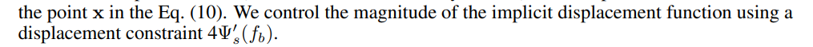

# Discussion on "HF-NeuS: Improved Surface Reconstruction Using High-Frequency Details"

## Questions:

Q1: 为什么MLPd前面的displacement function会有4乘数 
</img>

A: 这是一个偏移量的一个参数，是人为约定的，应该是实验中的经验数据，前文有过表述： 
</img>