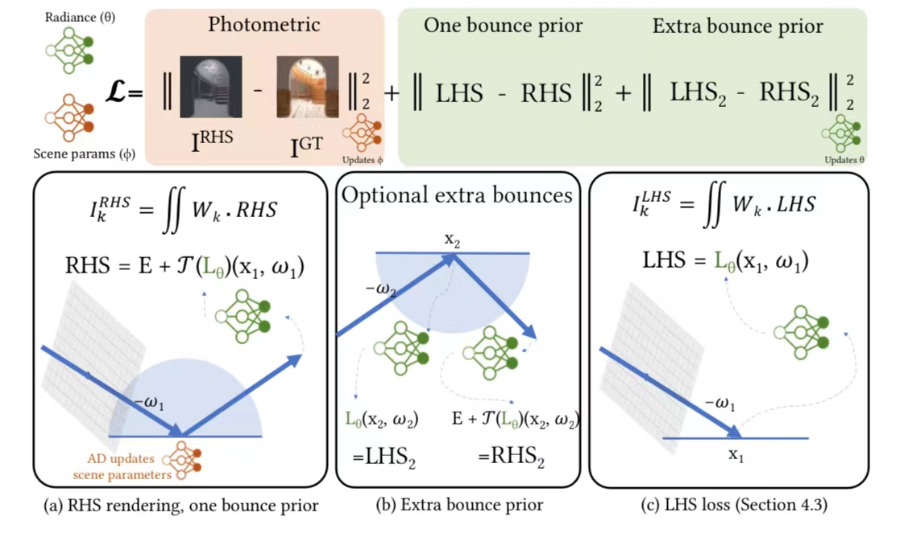

# Discussion on "NeRF: Representing Scenes as Neural Radiance Fields for View Synthesis"

## Summary

### Target
使用neural radiance field表达的radiometric prior来代替传统的path tracer，以达到快速、低内存消耗的全局光照恢复

### Technical History Path
* Rendering Equation (James T. Kajiya. 1986. The Rendering Equation. SIGGRAPH Comput. Graph. 20, 4 (aug 1986), 143–150. https://doi.org/10.1145/15886.15902）(导致path integral问题，速度极慢
* Automatic Differentiation (AD，解决path integral速度问题，但是内存消耗极大）
* RB、PRB（解决AD的内存消耗问题，速度仍然慢，噪声多，收敛速度慢）
Merlin Nimier-David, Sébastien Speierer, Benoît Ruiz, and Wenzel Jakob. 2020. Radiative Backpropagation: An Adjoint Method for Lightning-Fast Differentiable Rendering. ACM Trans. Graph. 39, 4, Article 146 (July 2020), 15 pages. https://doi.org/10.1145/3386569.3392406
* Delio Vicini, Sébastien Speierer, and Wenzel Jakob. 2021. Path Replay Backpropagation: Differentiating Light Paths Using Constant Memory and Linear Time. ACM Trans. Graph. 40, 4, Article 108 (jul 2021), 14 pages. https://doi.org/10.1145/3450626.3459804
* Radiosity，在 Real-Time Rendering 11.2.1中有提到，实用性不强
* Neural Radiosity，在不需要multi-bounce light path integrals的情况下，使用神经网络解决Rendering Equation
Saeed Hadadan, Shuhong Chen, and Matthias Zwicker. 2021. Neural Radiosity. ACM Trans. Graph. 40, 6, Article 236 (dec 2021), 11 pages. https://doi.org/10.1145/3478513.3480569
* 本工作，尝试基于AD + Neural Radiosity解决global illumination问题

### Method
避免解决Rendering Equation，将Render Equation通过一个neural radiance field表示为一个radiometric prior，并构建损失函数，构建出一个残差。

残差两边即为Rendering Equation的两边（Left Hand Side，Right Hand Side），最小化这个残差得到Rendering Equation的最优解。RHS渲染模型不需要path integral或path tracing，因此可以使用原始AD直接计算，从而达到快速、低内存的渲染效果。

### Results
从PSNR量级上Demo一组数据，更多数据参考论文，AD-Direct：11.72，PRB：30.34, 本工作w/o Prior：29.04，本工作：33.0

提升明显，且收敛速度比PBR快非常多。

### Limitations
没有model镜面材质的outgoing radiance，对场景中有大面积镜面物体时效果有损伤
没有联合优化材质、几何和光照，着重在global illumination会是一个future work方向

## Questions

Q1: 文章里面提到的transport operator是如何计算的，T(L_\theta)是如何计算的？

A1: 核心图：
</img>
theta是待优化的RF权重；phi是待优化的场景参数，比如环境光图，如果是以前的方法，使用可微分的路径追踪（比如psdr），需要bounce很多次（就和正常的pt一样），这会带来很大的内训和计算开销，但这个方法只用再bounce一次（我们现在不考虑extra）。以前算T的时候里面的L是靠递归的PT算的，现在的L是直接从NeRF里取值了。

A2: 本质还是invrender的用outgoing radiance近似全局光照，今年的texir就是受此启发，使用更compact的方式查询全局光照