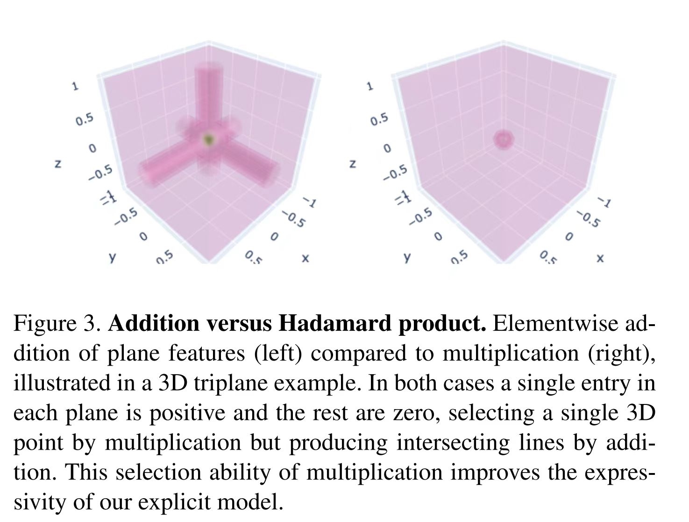

# Discussion over paper: "K-Planes: Explicit Radiance Fields in Space, Time, and Appearance"

## Questions

Q1: 如何理解文中下图：

</img>

Answer: 对于只有一个点的3D scene，这个点(x, y, z)对应的XY、YZ、XZ平面的feature都是正的，平面其他点对应的feature都是0。sample这个点的时候，加法和乘法没有很大区别，但是scene中的其他空白点，例如(x + 1, y, z)，使用加法的话那么feature本该是0的点会存在一部分(x, y, z) 在YZ平面的分量，就跟这个图画的一样。这就使得这些点和其他空白点区分开来了，会有artifacts。