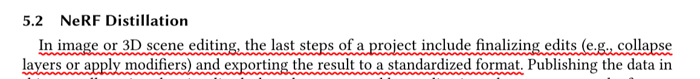

# Discussion on "Interactive Geometry Editing of Neural Radiance Fields"

## Questions

Q1: 这个nerf diftillation的动机是个什么意思,什么叫编辑的最后一步都要导出为标准格式呢？

</img>

A: 他只是想把这个形变场景导出为一个新场景而已，他是可以选定物体的部位进行编辑，编辑是通过基于cage的方法，编辑后的渲染应该是利用偏移量来进行计算的。所以我觉得这里的意思应该是正常的编辑应该是类似于deform+原NeRF，导出应该就是变成一个NeRF。他这里并不是真正的i形变，是类似于D-NeRF Nerfies hypernerf那种通过ray blending形变。这里的蒸馏就是把变形后的给提一个新的形变后的辐射场。他这里就是想吧这个deformed space下的场景导出来，用一般的nerf就能渲染，不需要经过ray blending。
