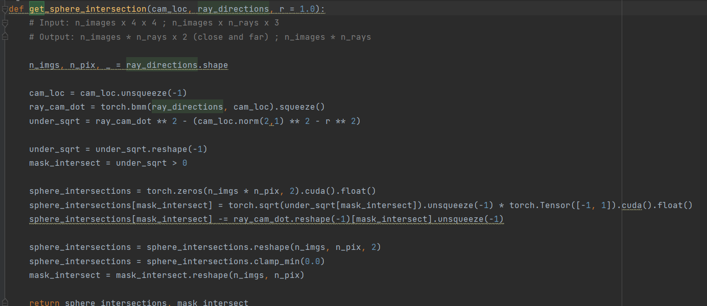

# Discussion on "NeRF: Representing Scenes as Neural Radiance Fields for View Synthesis"

## Author Summary

比较讨巧的混合了物理模型和神经网络，对单个物体，尤其是有高光的能较好的同时恢复几何和材质。特别是对人脸这样的高光很复杂的。DTU上像金属兔子的场景也能恢复的比NeuS好。

## Questions

Q1: ray_cam_dot代表什么呀?

</img>

A: 就是靠原点到直线的距离判断一个直线有没有与一个bounding sphere相交