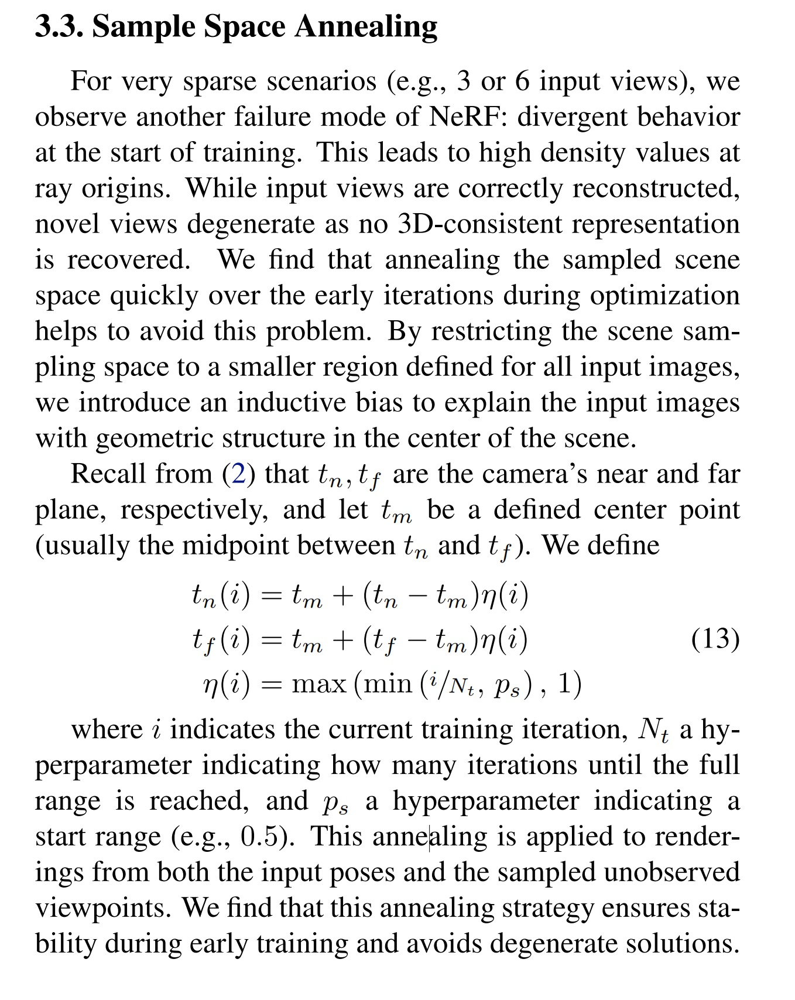

# Discssion for paper:　"RegNeRF: Regularizing Neural Radiance Fields for View Synthesis from Sparse Inputs"

## Questions

Q1: regnerf里的Sample Space Annealing的，这个只在method和ablation里面提了一嘴，有点没看懂
</img>

A: 主要公式是错的影响理解吧，η(i) =max(min(i/Nt, ps),1)，应该是η(i) = min(max(i/Nt, ps),1)。arXiv版本的论文有错，要参考google drive的版本：https://drive.google.com/file/d/1S_NnmhypZjyMfwqcHg-YbWSSYNWdqqlo/view?usp=sharing