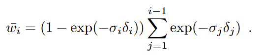

# Discussion on "Tetra-NeRF: Representing Neural Radiance Fields Using Tetrahedra"

## Questions

Q1: 文中公式3的累加运算符的位置好像有问题，应该在exp操作之内，是不是有问题？

</img>

A: 从作者拿到的回应：Of course the exp should be outside the sum. I don’t know how I could have missed it in the manuscript. We will update the paper soon。应该是一错原文写错，作者将尽快修改menuscript的，阅读时需要注意这里。
