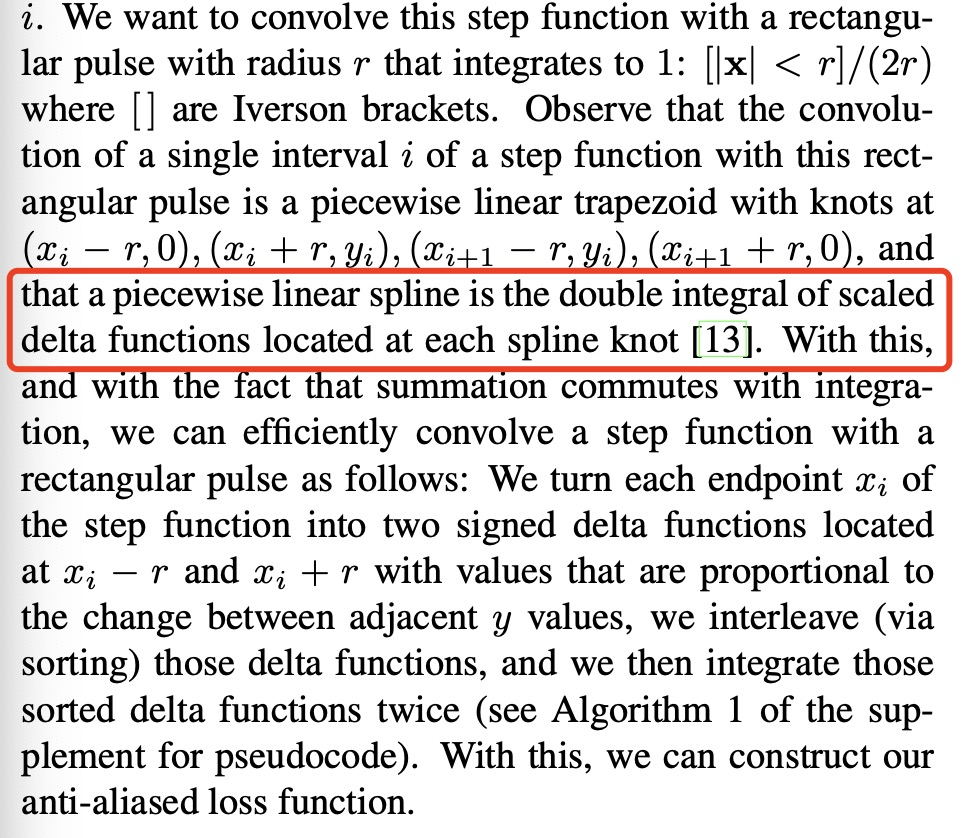

# Discussion for paper: "Zip-NeRF: Anti-Aliased Grid-Based Neural Radiance Fields"

## Questions

Q1: 以下整段应该怎么理解

</img>

A: 它目标是为了smooth一个step function，考虑它的反锯齿效果。但因为这个function是连续的，所以还不能用高斯或其他的box filter，所以就设计了一个新的filter，在一个interval两头取四个点，起始点水平方向+-r, 结束点水平方向+-r，然后做样条插值。这样能保证连续函数也能平滑。剩下的就是如何算卷积。上古大神Paul的FILTERING BY REPEATED INTEGRATION，就提供了这么种方法，We find that convolution of a signal with any piecewise polynomial kernel of degree n − 1 can be computed by integrating the signal n times and point sampling it several times for each output sample. 这样就没啥问题了。
