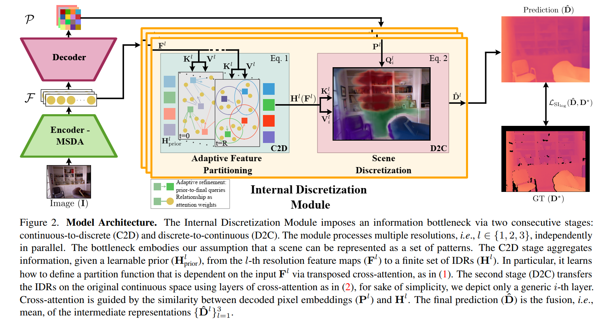
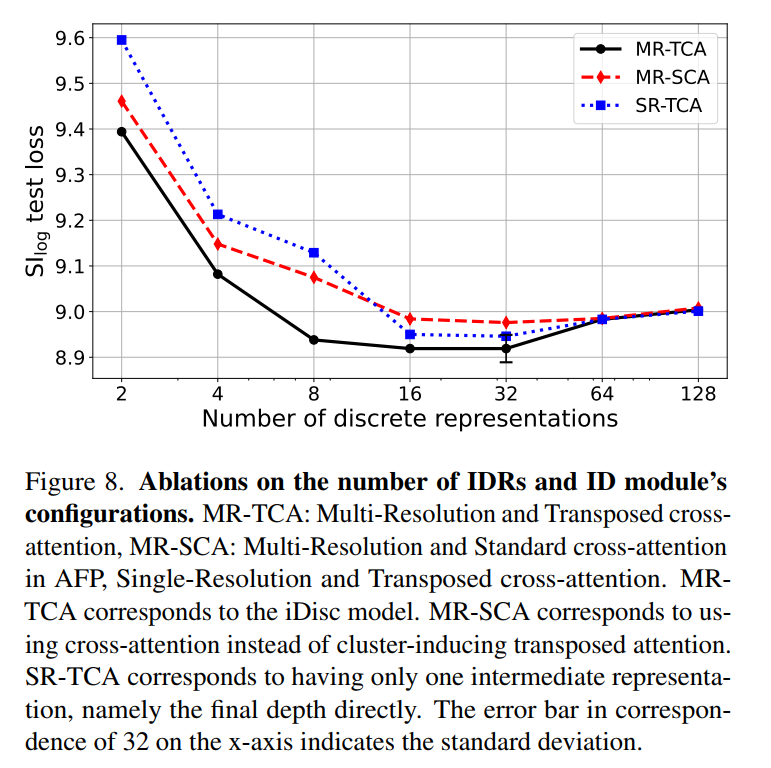

# Discussion on paper "iDisc: Internal Discretization for Monocular Depth Estimation"

## Summary:

单图的depth estimation，理解不一定对，讲出来讨论哈。它那个adaptive feature partitioning，在三个分辨率维度上搭了三个独立的cross-attention结构去训练，多分辨率的融合结果为预测的深度图，去跟GT算loss。训练得到的结果就可以evaluate新图像的深度图。

AFP那相当于是feature聚类的方法（聚类为N个IDR），然后独立的在三个分辨率上去训练，把场景用聚类结果离散化了。里面比较有特点的是把attention里运算改成了transposed cross-attention，也没细说它的理论基础，Ablation里看到这么做，loss更低的（这个是不是其他的transformer方案也可以尝试一下，看是否有增益），看起来能达到的效果是聚类数量相对小的时候，收敛度更好，如果聚类数量较多，会退化跟标准attention一致。

</img>
</img>
