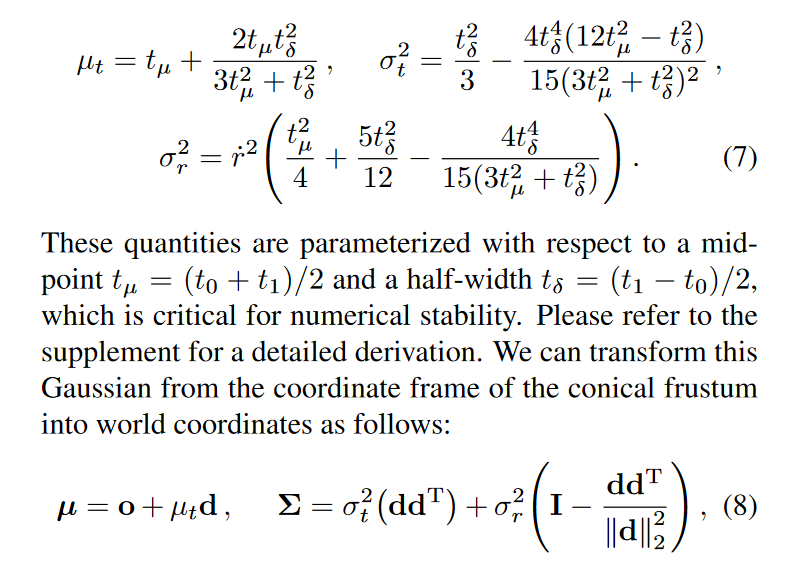
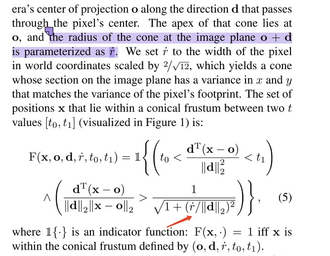
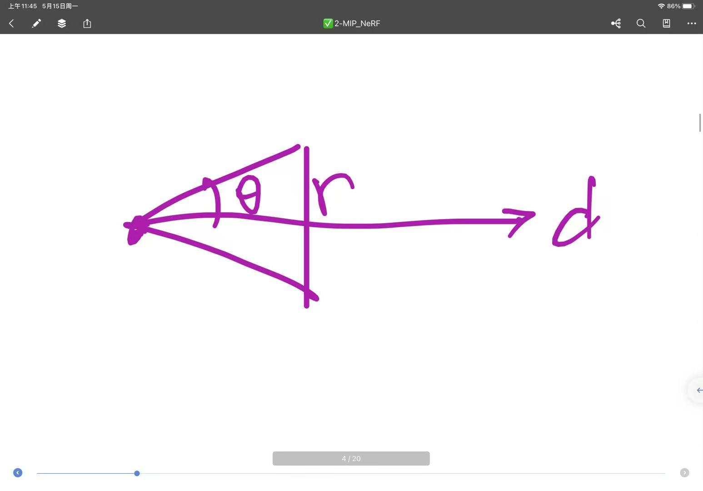

# Discussion on "Mip-NeRF: A Multiscale Representation for Anti-Aliasing Neural Radiance Fields"

## Questions

Q1: Mip-Nerf里坐标变换后的第二项矩阵是怎么求得(Equation 8)

</img>

A: 可以参考J. Barron在[Issue](https://github.com/google/mipnerf/issues/6)里的回复

Q2:公式5箭头指向的部分怎么理解呀，为什么pixel width要除以direction的模呢，前面这项为什么要大于后面这个比值呢

</img>

A: 
</img>

采样点要在这个圆锥范围内，这一项表示角度关系，最大的角度就是你arctan(像素半径/方向的模长)