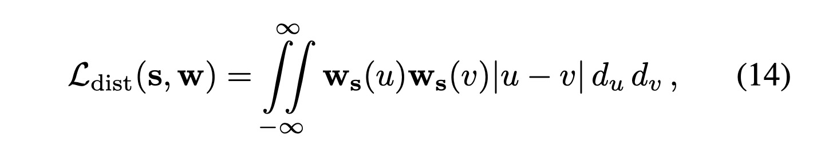
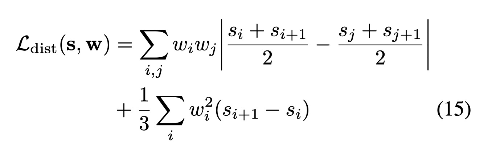
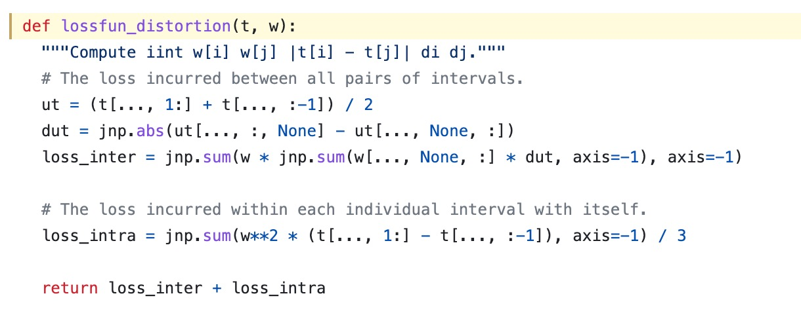

# Discussion on "Mip-NeRF 360: Unbounded Anti-Aliased Neural Radiance Fields"

## Question

Q1: 以下论述的解释是什么，原理是什么

    The original NeRF paper regularized ambiguous scenes by injecting Gaussian noise into the density headof the NeRF MLP before the rectifier [33], which encourages densities to gravitate towards either zero or infinity. Though this reduces some "floaters" by discouraging semi-transparent densities, we will show that it is insufficient forour more challenging task.

A: 理想的真值应该都是0和inf，半透明物体才理解为过拟合观测图像导致的泛化性不佳。加入噪声可以一定程度上避免过拟合，类似于dropout的效果，也和花书的内容一致。

A: 半透明体一般为floater，加入高斯噪声后，将density推向0或inf，降低半透明体存在的概率，一定程度上提升渲染质量

Q2: 论文中，Eq. 14向Eq.15推导的过程是怎么样的？

</img>
</img>
</img>

A: 我先说我的理解哈，群里大佬们帮纠正。首先我认为它这个连续到离散的过程不是推导出来的，而是简化问题出来的（想象原始连续公式是算法一，被简化为算法二，虽然形式不一样，但目标完全相同）。可以这么做的原因就是因为它是step function，每一个interval是一个常数，那就可以把原公式里的区域loss问题简化为step funtion之间的lossfun。

那这样就只有两种情况了，一种为inter case，用区间的中点加权去算，另一种是intra case，每个区间内权重平方，乘以区间大小。然后加起来就可以达到跟原公式一样的目标和效果（而不是推导）。

1/3我认为是个尺度因子哈，有可能是个实验值，没有应该也OK，但是也许会让intra部分权重过高导致结果不好。
